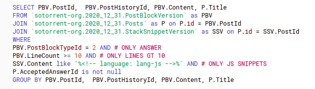

# Content of this repository
This is the repository that contains the scripts and dataset for the MSR 2021 mining challenge

=======
# DATASET
The dataset can be found here : https://zenodo.org/record/2593818
The dataset was retrived utilizing google bigquery and dumped to a csv
file for further processing, this original file with no treatment is called jsanswers.csv, here we can find the following information :
1. The Id of the question (PostId)
2. The Content (in this case the code block)
3. The title

A quick look at this files, one can notice that a postID can have multiple rows related to it, that's how multiple codeblocks are saved in the database.
#  SOTorrent - BIG QUERY SELECT
<h1 align = "center">
    
</h1>

## Filtered Dataset

### Extracting code from CSV
We used a python script called "ExtractCodeFromCSV.py" to extract the code from the original csv and merge all the codeblocks in their respective javascript file with the postID as name, this resulted in 257 thousand files.

### Running ESlint
Due to the single threaded nature of ESlint, we needed to create a script to run ESlint because it took a huge toll on the machine to run it on 257 thousand files, this script is named "eslint_runner.js", it splits the files in 40.000 evenly distributed parts and runs 40.000 processes of esLinter to generate the reports, as such it generates 40.000 json files.

### results files
This information was extracted using the script named "parser.js", it generated the files in "result" folder named "aggregation.json", "commons.json", "distribution.json", "erros.json" and "total.text" which contains the statictics of linter configuration in the dataset.

### commons.json
statistics with commons errors in per group in dataset, this information was extracted using the same "parser.json" script.

### aggregation.json
statistics with sum of aggregation groups in the the dataset, we generated the number of violations per category group as defined in the eslinter website, this information was extracted using the same "parser.json" script.

### rules.json 
The file Rules with categories contains all the rules used and their categories.
